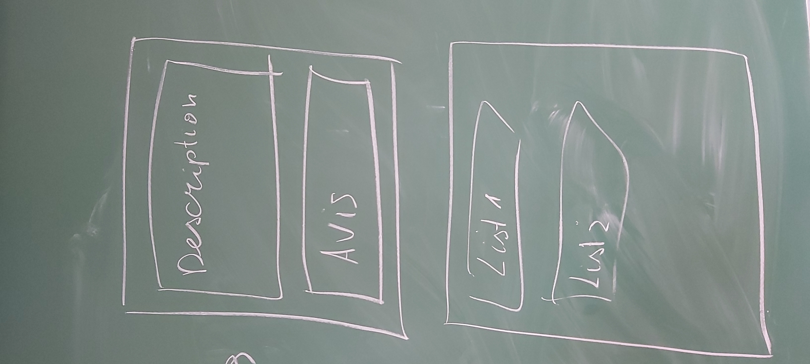

# Projet MOBG5

Ce dépôt contient les sources du projet "SpacMovie".

## Description

L'application permet de voir les films par catégorie (exemples : les films populaire, les films mieux noté, les films à venir),
chercher un film ,lire la description du film, ajouter un film a une liste personalisé (exemple :favoris),
ecrire un avis sur un film

## Persistance des données

Les données relatives aux comptes utilisateurs, aux listes et aux avis sont persistées via firebase : https://firebase.google.com

## Service rest

Pour collecter les données relatives aux films, des appels au service rest suivant sont effectués : https://www.themoviedb.org/documentation/api

## Images 

## Auteur

**Butuc Andrian** g54254
  